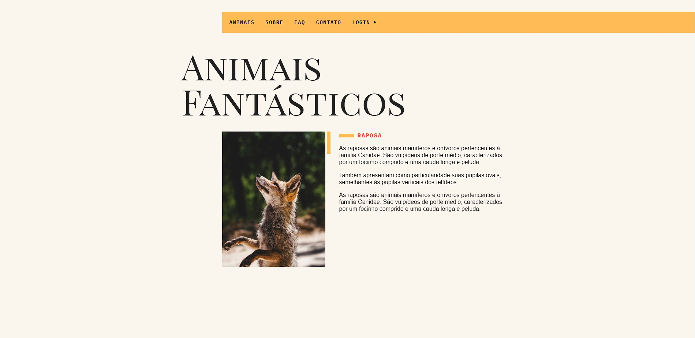

# Animais Fantásticos 🐻

<br><br>

<p align="center">
  <a href="#-about-the-project">About the project</a> •
  <a href="#-technologies">Technologies</a> •
  <a href="#-getting-started">Getting started</a> •
  <a href="#-license">License</a>
</p>

<p align="center">
  
</p>
 
 
  
## 👩‍💻 About the project

**Animais Fantásticos** is a project developed in the [Origamid's ES6 Complete JavaScript course](https://www.origamid.com/).  
The project was created to apply the studies from the JavaScript classes.
With effect manipulation in the DOM, Asynchronous JavaScript, debounce and Modules.

[click here, see closer](https://animais-fantasticos-fawn.vercel.app/) 😉

## 🚀 Technologies

- HTML5 & CCS3
- JavaScript
- NodeJs
- Webpack
- Eslint
- Babel

## 💻 Getting started

### Requirements

- [Node.js](https://nodejs.org/en/)
- [Yarn](https://classic.yarnpkg.com/) or [NPM](https://www.npmjs.com/) _(examples are with yarn)_

**Clone the project and access the folder**

```bash
$ git clone https://github.com/leandrorodrigues00/animais-fantasticos && cd animais-fantasticos

```

**Follow the steps below**

```bash
# Install the dependencies
$ yarn


# Start the app
$ yarn dev

# Navigate to http://localhost:3000
# The app will automatically reload if you change any of the source files.
```

## 📝 License

This project is licensed under the MIT License - see the [LICENSE](LICENSE) file for details.

---

<p align="center">
  Made with 💜&nbsp; by  Leandro Rodrigues
</p>
